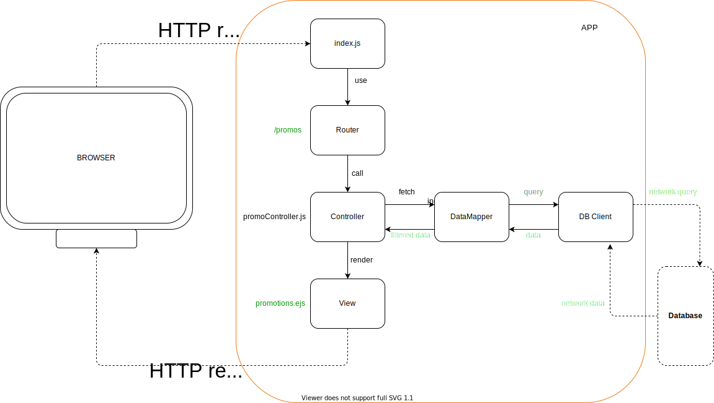
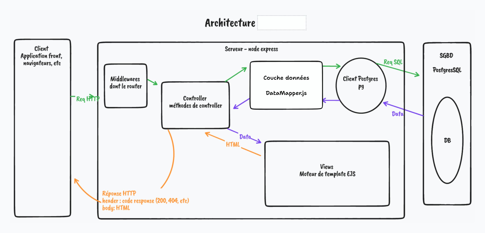

# Architecture

Le rôle d'une architecture logicielle est de séparée les concepts en différents composants logiciels.  
Chaque composant est responsable d'une partie spécifique de l'application.  
Ce qui facilite sa gestion, sa maintenance et son évolutivité.

Il n'existe pas d'architecture absolue, bien qu'on puisse retrouver des similitudes entre les projets. Le tout c'est de comprendre la place et l'utilité de chaque composant.

## Rappels

[Architecture](https://whimsical.com/support-visuel-TtYnQXMeoTWgA9JxmeugBi)

- `index.js` => Le point d'entrée du server node/express. C'est là qu'on met en place le serveur.
- `public/` => Le dossier contenant tous les assets staiques qui doivent être accessiblent par le navigateur (imgs, fints, css)
- `app/` ou `src/` => Le dossier qui va contenir notre code source (celui de l'application)
- `src/router.js` => Le fichier dans lequel on va définir nos routes. Il est possible de faire plusieurs router (un par type de route. ex : userRouter, quizRouter, etc)
- `src/controller/` => Dossier contenant les controllers. C'est ici que vient la logique de contrôle de l'application
- `src/views/` => Dossier contenant les fichiers de template. Pour les vues de l'application
- `src/middlewares/` => Dossier contenant nos différents middlewares (fonctions branchée les unes à la suite des autres, dans lesquelles passent les requêtes HTTP)
- `data/` => Dossier contenant les script SQL (ou autre fichier liés au données)

Il existe d'autres fichiers qui ne font pas partie de l'architecture mais qui sont essentiels pour le bon fonctionnement de l'paplication

- `package.json` => fiche d'identité du projet
- `node_modules/` => contient toutes les dépendances installées avec npm
- `.gitignore` => Pour ignorer les fichiers et dossiers pour les commits
- `.env` / `.env.sample` => Les variables d'environnement. **A NE JAMAIS COMMITER** sinon fuite de données sensibles !!!

