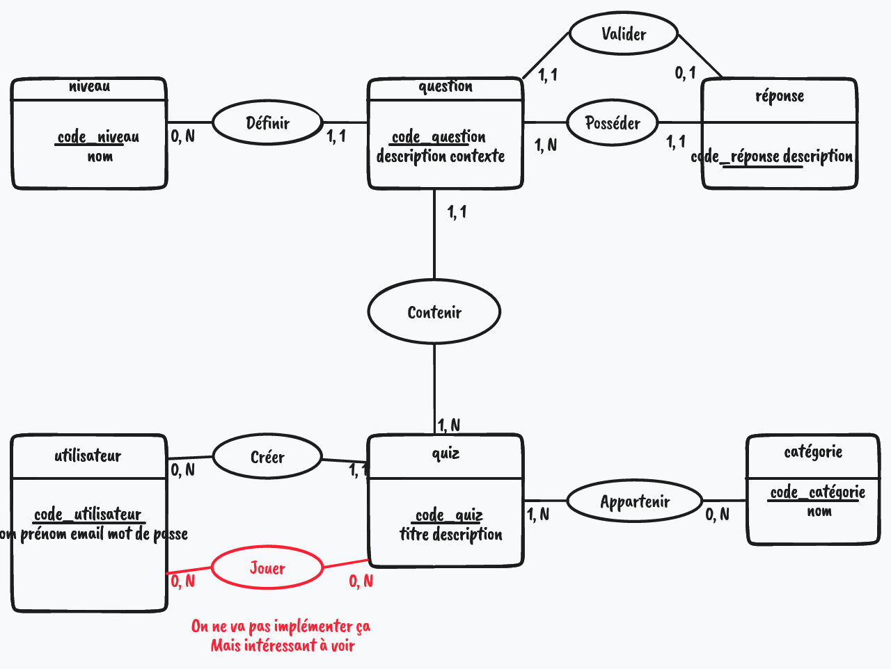

# MCD

Le **Modèle Conceptuel de Données** est une étape importante dans la conception d'un projet. Il permet de définir les différentes entités de notre application et de visualiser les relations qui les lient.

:warning: **Important - Ici on ne parle pas encore de**

- d'ID
- de clé étrangère
- de tables
- de champs
- ou encore de colonnes

On est au niveau conceptuel et ces termes sont déjà trop techniques. C'est le vocabulaire réservé au MLD : l'étape d'après

On parlera plutôt de

- de détérminant
- d'entité
- d'attributs
- relations
- et de cardinalités

## Entités

- utilisateur
- quiz
- thème
- question
- difficulté
- réponse

## Attributs

On vient mettre en place les différents attributs de nos entité directement sur le schéma

## Les relations et cardinalités

On met en place un verbe qui définit la relation entre 1 ou plusieurs entités.

Les cardinalités sont les quantités minimum et maximum qui peuvent exister entre deux entités A et B.

Pour mettre en place les cardinalités, il faut se poser les bonnes questions :

- L’entité A est « liée » à combien d’entités B au minimum ? => 0 ou 1
- L’entité A est « liée » à combien d’entités B au maximum ? => 1 ou n
- L’entité B est « liée » à combien d’entités A au minimum ? => 0 ou 1
- L’entité B est « liée » à combien d’entités A au maximum ? => 1 ou n

## Mcd final

## Transformation MLD

user( id, lastname, firstname, email, password )
quiz( id, title, description, #user_id )