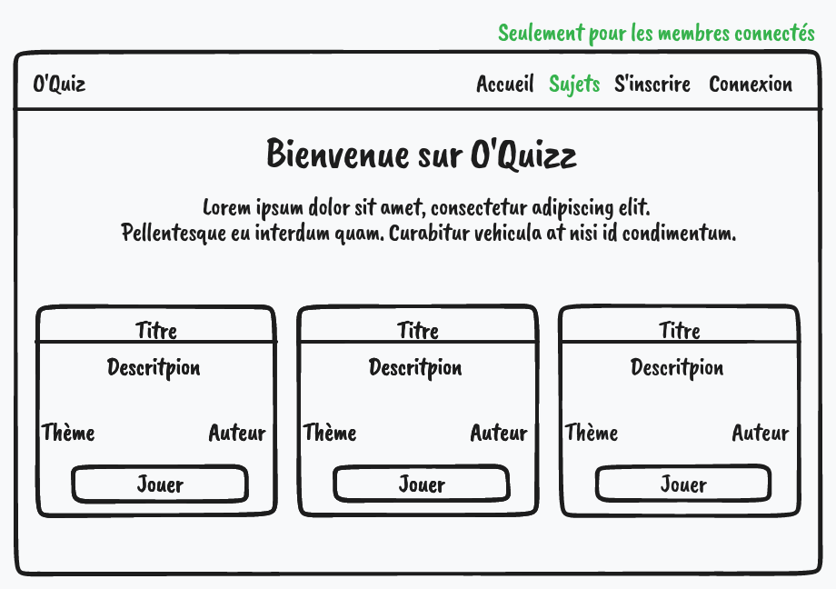
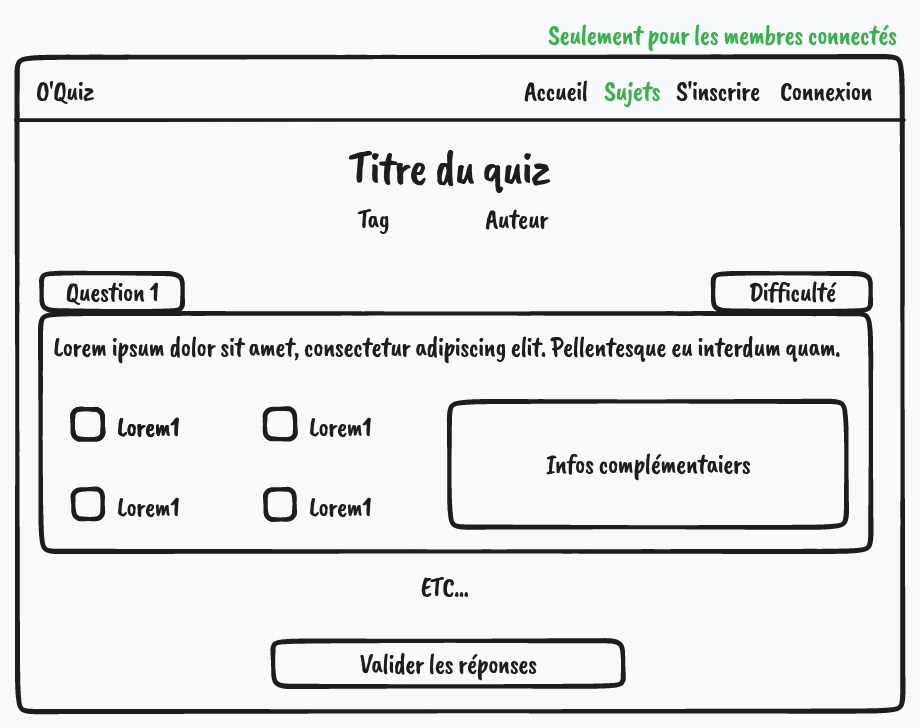

# Wireframes

Ce sont des croquis de l'interface utilisateur (UI) permettant de définir les zones et composants qu'elle doit contenir.

C'est l'étape qui précède la maquette contenant le design du site (identité visuelle, charte graphique, police etc)

L'avanatge c'est de valider rapidement aveac le client avant de se lancer dans un long chantier qui ne lui plaierait pas (et donc perte de temps et d'argent)

- [Tldraw](https://www.tldraw.com/)
- [Figma](https://www.figma.com/fr/)
- [Wireframe.cc](https://wireframe.cc/)
- Crayon et papier
- etc...

Accueil

Page quiz

